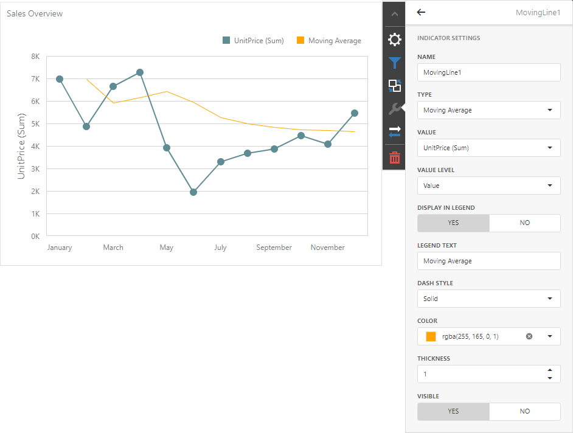

<!-- default badges list -->

<!-- default badges end -->

# BI Dashboard for ASP.NET Core - Custom Trend Indicator

The following example creates a custom ASP.NET Core “Moving Average” indicator (when using DevExpress BI Dashboard):

1. Create a [ChartCustomIndicator](https://docs.devexpress.com/Dashboard/DevExpress.DashboardCommon.ChartCustomIndicator) descendant (the `MovingIndicator` class in this example). `MovingIndicator` accepts a collection of data points, evaluates values, and returns resulting points. These points are used to draw the indicator.

2. Register `MovingIndicator` in [IndicatorFactory](https://docs.devexpress.com/Dashboard/DevExpress.DashboardCommon.IndicatorFactory) to make it available as an indicator type. Call the [Register](https://docs.devexpress.com/Dashboard/DevExpress.DashboardCommon.IndicatorFactory.Register--1(System.String)) method in your application before you save and load a dashboard (to serialize and deserialize the indicator within the dashboard’s XML).

3. Register [ChartIndicatorsExtension](https://docs.devexpress.com/Dashboard/js-DevExpress.Dashboard.Designer.ChartIndicatorsExtension) before the control is rendered to add the `MovingIndicator` type to the Trend Indicators editor.

4. Create an instance of `MovingIndicator` and specify desired indicator settings.

5. Once you launch the application, open the Trend Indicators editor and add the new "Moving Average" indicator type.

## Files to Review

- [Program.cs](./trend-indicators/Program.cs) 
- [MovingIndicator.cs](./trend-indicators/Data/MovingIndicator.cs) 
- [_Layout.cshtml](./trend-indicators/Pages/_Layout.cshtml)                               

## Documentation

- [Trend Indicators](https://docs.devexpress.com/Dashboard/404416/web-dashboard/create-dashboards-on-the-web/dashboard-item-settings/chart/trend-indicators?v=23.1)
<!-- feedback -->
## Does this example address your development requirements/objectives?

 

(you will be redirected to DevExpress.com to submit your response)
<!-- feedback end -->
